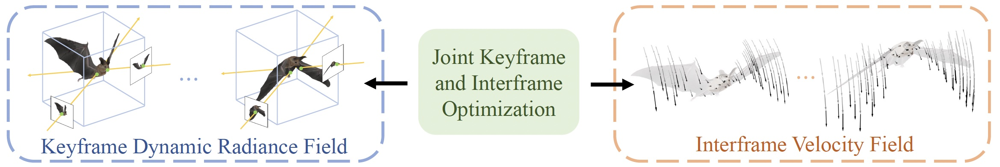

# NVFi: Neural Velocity Fields for 3D Physics Learning from Dynamic Videos (NeurIPS 2023)


We present a novel framework to simultaneously learn the geometry, appearance, and physical velocity of 3D scenes only from video frames, such that multiple desirable applications can be supported, including future frame extrapolation, unsupervised 3D semantic scene decompositio, and dynamic motion transfer.


# Environment Setup
```
    # create conda environment
    conda create --name nvfi python=3.9
    
    # activate env
    conda activate nvfi
    conda install pytorch==1.12.1 torchvision==0.13.1 torchaudio==0.12.1  cudatoolkit=11.6 -c pytorch -c conda-forge
    pip install functorch==0.2.1
    
    # If you want to run for segmentation application, run the following
    conda install pytorch3d -c pytorch3d

    # pip install 
    pip install -r requirements.txt

```
# Datasets
Both Dynamic Object and Dynamic Indoor Scene datasets could be downloaded from [google drive](https://drive.google.com/drive/folders/1je-JW64UvRJ2hmA6nzEKA7VGRIn4lAi6?usp=sharing). 

Please change the "logdir" and "basedir" in config based on the locations of downloaded datasets.

# Training
We provide several config files under [config](./config/) folder for different datasets.

For reconstruction, you can run
```
python train_nvfi.py --config ./config/InDoorObj/bat.yaml --static_dynamic 
```

If you want to train the segmentation fields, simply run the following commend
```
python train_segm.py --config config/InDoorObj/bat.yaml --checkpoint -1
```

# Evaluation
For future frame extrapolation, you can render the results by running
```
python train_nvfi.py --config ./config/InDoorObj/bat.yaml --checkpoint -1 --not_train --eval_test
```

For segmentation prediction, you can run
```
python test_segm_render.py --config config/InDoorObj/bat.yaml --checkpoint -1 --ckpt_segm 1000
```


# Citation
If you find this code useful, please consider citing:

